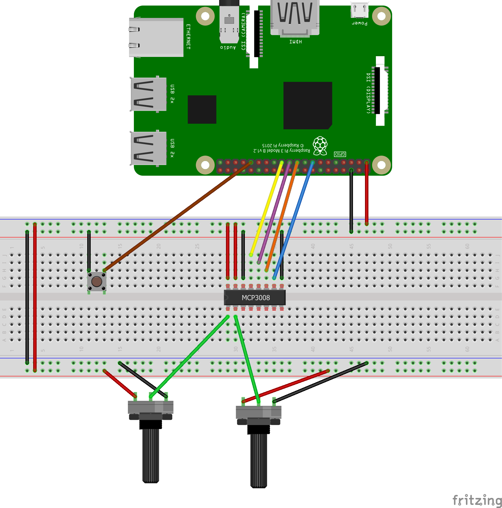

# Etch-A-Sketch

A simple rasperry pi based Etch-a-Sketch program. Since the pi doesn't have analog inputs, you'll need a simple circuit to connect two potentiometers up. These will serve as the X and Y axis 'paddles' that move the cursor. There is also a button which lets you clear the screen (since shaking your display isn't going to do anything).

Parts Needed
* Raspberry Pi (any will do, I did this with an older Pi 3 B+)
* Breadboard and some jumper wires
* Two 10K Potentiometers (or similar, anything ought to work)
* A pushbutton
* One MCP3008 A/D converter (https://www.adafruit.com/product/856)

[]

The trickiest bit is just making sure you connect to the right GPIO pins on the Pi- the MCP3008 uses the SPI interface so it's only four wires. The tutorial at Adafruit (https://learn.adafruit.com/reading-a-analog-in-and-controlling-audio-volume-with-the-raspberry-pi) is excellent should get you working in no time.

Also make sure you get the polarity correct on your pots as it affects the direction of movement when you rotate. If you do positive/negative differently on each then the direction will be different as you increase the resistance.

Most of the software that you need is already on the pi, but you'll need to add a few additional python packages.

    $ sudo apt-get install python3-pip
    $ sudo pip3 install pygame
    $ sudo pip3 install sudo pip3 install adafruit-blinka
    $ sudo pip3 install adafruit-circuitpython-mcp3xxx

The program takes over the console entirely and is designed to be run outside of a GUI. So you can simply run it with:

    $ sudo python3 ./game.py

This should work over ssh as well (although you'll need a monitor connected to your pi). Use the pots to move the lines around and hit the button to clear the screen.